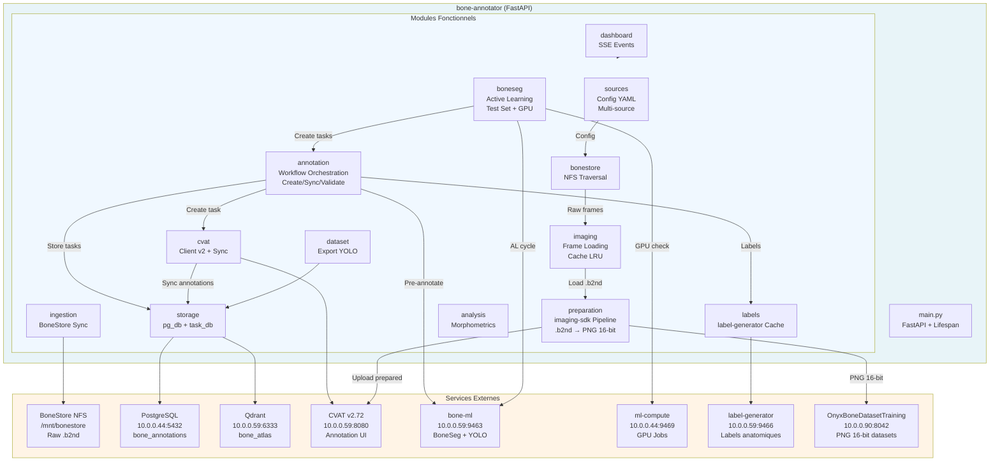
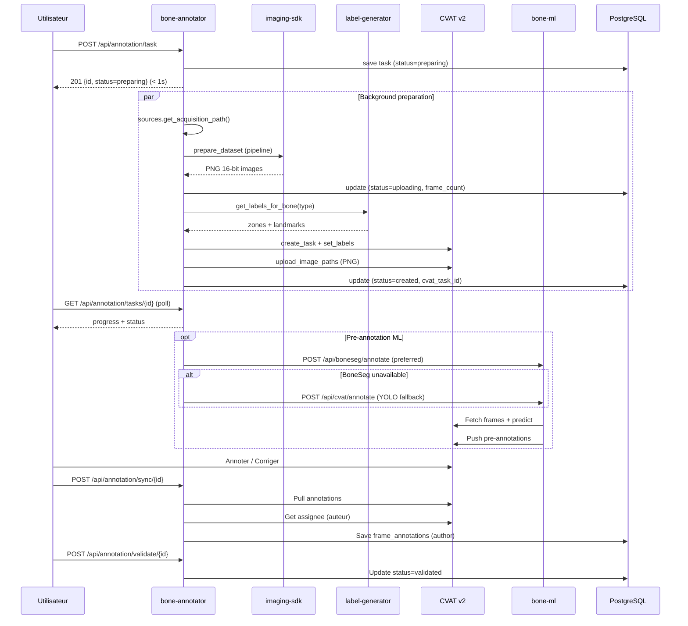
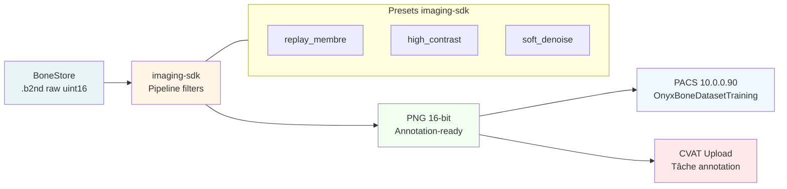
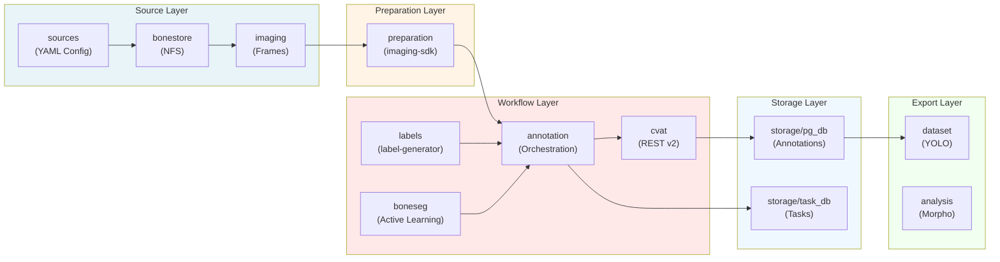

# bone-annotator - Diagramme Architecture

## Vue Générale des Composants

## Workflow Annotation Complet

## Pipeline Préparation Images

## Modules & Responsabilités

---

**Dernière mise à jour**: 2026-08-30
**Phase**: Dashboard admin + imaging-sdk pipelines
**Version**: v0.1.61

