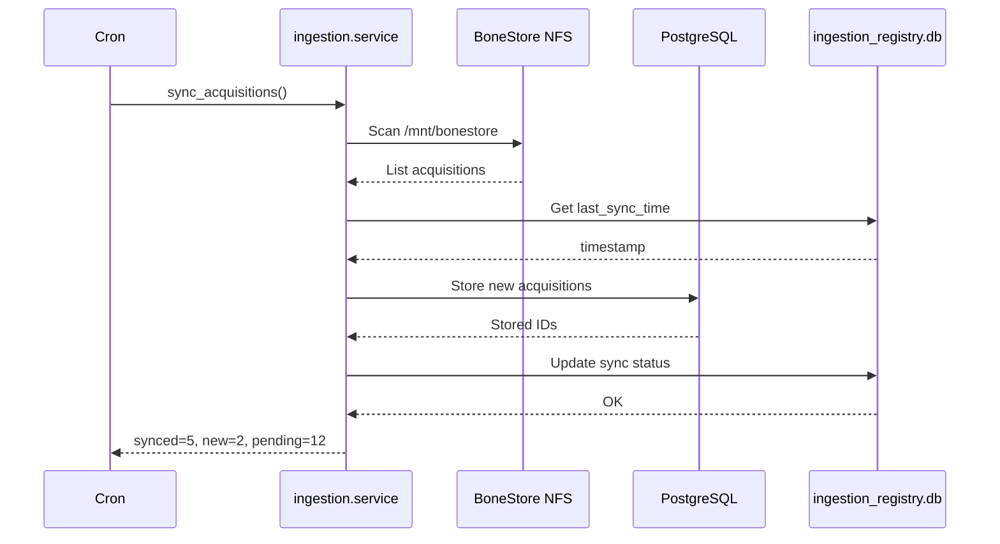
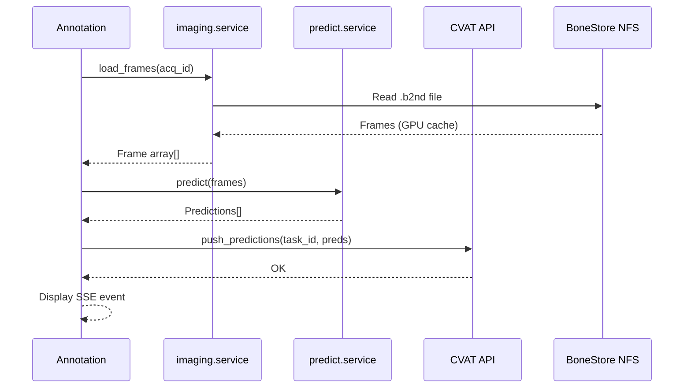
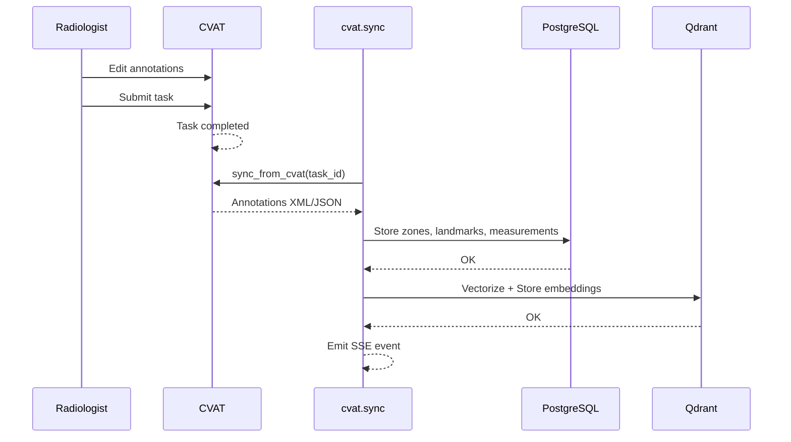
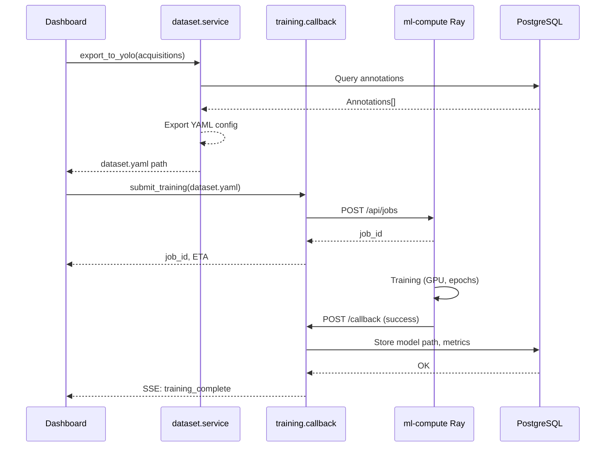
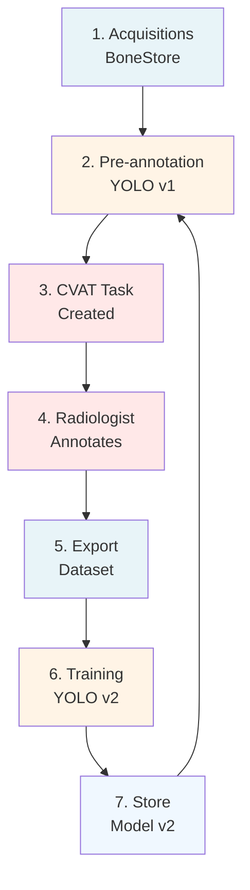
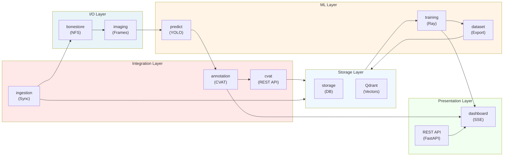

# bone-annotator - Diagramme Architecture

## Vue Générale des Composants

```mermaid
graph TB
    subgraph External["Services Externes"]
        BS["BoneStore NFS<br/>10.0.0.52<br/>/mnt/bonestore"]
        PG["PostgreSQL<br/>10.0.0.59:5433<br/>bone_annotations"]
        QD["Qdrant<br/>10.0.0.59:6333<br/>bone_atlas + bone_annotations"]
        CVAT["CVAT Server<br/>Synapse<br/>Annotation séries"]
        ML["ml-compute<br/>10.0.0.44:9469<br/>Ray Jobs API"]
        LG["label-generator<br/>10.0.0.59:9466<br/>Labels anatomiques"]
    end

    subgraph BoneAnnotator["bone-annotator (FastAPI)<br/>Port 9468 - OnyxSynapse"]
        Main["main.py<br/>FastAPI App<br/>Lifespan"]
        
        subgraph Modules["Modules Fonctionnels"]
            BoneStoreM["bonestore<br/>NFS Traversal"]
            ImagingM["imaging<br/>Frame Loading<br/>Cache LRU GPU"]
            AnnotationM["annotation<br/>CVAT Orchestration"]
            StorageM["storage<br/>PostgreSQL + Qdrant"]
            IngestionM["ingestion<br/>BoneStore Sync<br/>Registry"]
            PredictM["predict<br/>YOLO Inference"]
            TrainingM["training<br/>Ray Jobs Submit"]
            DatasetM["dataset<br/>Export YOLO Format"]
            CVATModuleM["cvat<br/>CVAT REST API"]
            DashboardM["dashboard<br/>SSE Events"]
        end
        
        Models["models.py<br/>Pydantic Schemas"]
    end

    subgraph Flows["Flux de Données"]
        Flow1["Ingestion Pipeline"]
        Flow2["Pre-annotation Pipeline"]
        Flow3["Annotation Pipeline"]
        Flow4["Training Pipeline"]
    end

    %% Connections
    Main --> Modules
    Modules --> Models
    
    BoneStoreM --> BS
    ImagingM --> BS
    AnnotationM --> CVAT
    StorageM --> PG
    StorageM --> QD
    IngestionM --> BS
    IngestionM --> StorageM
    PredictM --> ML
    TrainingM --> ML
    DatasetM --> StorageM
    CVATModuleM --> CVAT
    AnnotationM --> CVATModuleM
    PredictM --> ImagingM
    DashboardM --> Modules
    
    %% Flow connections
    Flow1 -.->|BoneStore NFS Discovery| IngestionM
    Flow1 -.->|Store Metadata| StorageM
    
    Flow2 -.->|Load Frames| ImagingM
    Flow2 -.->|YOLO Predict| PredictM
    Flow2 -.->|Push to CVAT| AnnotationM
    
    Flow3 -.->|Manual Annotations| AnnotationM
    Flow3 -.->|Store in DB| StorageM
    
    Flow4 -.->|Export Dataset| DatasetM
    Flow4 -.->|Submit Training| TrainingM
    Flow4 -.->|Store Models| StorageM
    
    LG -.->|Fetch Labels| AnnotationM

    style BoneAnnotator fill:#e8f4f8
    style External fill:#fff4e6
    style Modules fill:#f0f8ff
    style Flows fill:#f0fff0
```

## Flux Détaillés

### 1. Ingestion (Sync BoneStore)

### 2. Pré-annotation (YOLO)

### 3. Annotation Manuelle (CVAT)

### 4. Training Actif (YOLO)

### 5. Boucle d'Apprentissage Actif

## Modules & Responsabilités

---

**Dernière mise à jour**: 2026-08-09
**Phase**: 2 (CVAT Enhancement & ml-compute Training)
**Version**: v0.1.11+
