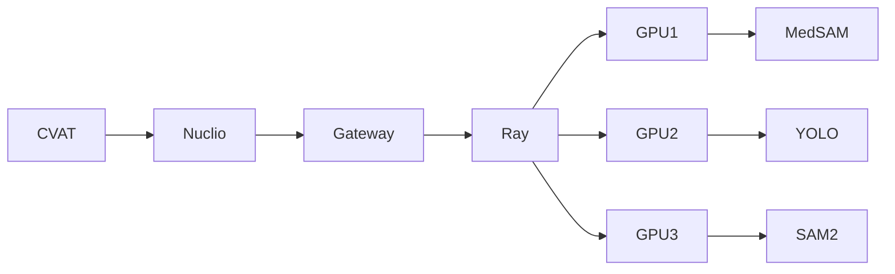

# Prompt — Intégration CVAT + Nuclio + Ray + Nomad pour annotation radiologique assistée par IA

Tu es un ingénieur senior DevOps/MLOps spécialisé en vision médicale, CVAT, Nuclio, Ray, Nomad, Docker, GPU NVIDIA et déploiement de modèles PyTorch.

Je dispose déjà d'une infrastructure fonctionnelle avec :

* **CVAT** pour l'annotation d'images radiologiques et fluoroscopiques vétérinaires
* **Nuclio** pour exposer des modèles IA dans CVAT
* **Ray** comme infrastructure de calcul distribué / orchestration des workloads ML
* **HashiCorp Nomad** pour administrer et déployer les services sur plusieurs machines
* **Prometheus + Grafana** pour la supervision
* plusieurs machines GPU NVIDIA
* une machine dédiée annotation/inférence avec **RTX 4070 12 Go**
* Docker installé
* réseau local entre les machines
* CUDA/NVIDIA Container Toolkit disponibles sur les nœuds GPU

L'objectif est de transformer l'installation actuelle en une plateforme d'annotation radiologique assistée par IA, modulaire et évolutive.

## Objectif général

Mettre en place cette architecture :

```text
                         UTILISATEUR
                              │
                              ▼
                            CVAT
                              │
                   ┌──────────┴──────────┐
                   │                     │
             annotation              Auto annotation
                   │                     │
                   ▼                     ▼
                Nuclio              AI Gateway
                                         │
                                         ▼
                                        Ray
                                         │
              ┌──────────────────────────┼──────────────────────────┐
              │                          │                          │
              ▼                          ▼                          ▼
          Interactors                Detectors                 Trackers
              │                          │                          │
        SAM / MedSAM                  YOLO                      SAM2
        LiteMedSAM               custom models              MedSAM2
              │                          │                          │
              └──────────────────────────┼──────────────────────────┘
                                         │
                                         ▼
                                  résultats CVAT
```

Nomad doit gérer le déploiement des différents composants sur les machines du cluster.

Ray doit gérer l'exécution distribuée des modèles IA et permettre de choisir automatiquement le GPU/nœud approprié.

Nuclio doit rester l'interface privilégiée avec CVAT lorsque c'est pertinent.

---

# 1. Commencer par auditer l'existant

Avant toute modification :

1. inspecte les fichiers Docker Compose existants ;
2. inspecte la configuration CVAT ;
3. inspecte la configuration Nuclio ;
4. recherche les fonctions Nuclio déjà installées ;
5. inspecte le cluster Ray ;
6. inspecte les jobs et clients Nomad ;
7. détecte les nœuds disposant de GPU ;
8. détecte les modèles déjà présents ;
9. vérifie les versions :

   * CVAT
   * Nuclio
   * Ray
   * Nomad
   * Docker
   * NVIDIA driver
   * CUDA
   * PyTorch
10. vérifie la communication réseau entre CVAT, Nuclio, Ray et les workers.

Ne détruis ni ne remplace une installation fonctionnelle sans raison.

Réutilise les composants existants.

Fais une sauvegarde des fichiers de configuration avant modification.

---

# 2. Architecture cible

Je veux séparer clairement quatre niveaux.

## Niveau 1 — CVAT

CVAT reste l'interface humaine principale.

Il doit pouvoir appeler plusieurs outils IA :

```text
SAM
LiteMedSAM
MedSAM
SAM2
MedSAM2
YOLO Detection
YOLO Segmentation
YOLO Pose
modèles propriétaires futurs
```

Les résultats doivent pouvoir revenir dans CVAT sous forme :

```text
bounding boxes
polygons
masks
keypoints
tracks
```

---

# 3. Nuclio

Nuclio doit servir d'adaptateur entre CVAT et les services IA.

Évite si possible de charger une copie complète de chaque gros modèle dans chaque fonction Nuclio.

Je préfère l'architecture :

```text
CVAT
 ↓
Nuclio function légère
 ↓
AI Gateway
 ↓
Ray Serve
 ↓
modèle GPU
```

Exemple :

```text
CVAT
 ↓
cvat-medsam
 ↓
POST /segment/medsam
 ↓
Ray Serve
 ↓
MedSAM actor GPU
 ↓
mask
 ↓
Nuclio
 ↓
CVAT
```

Les fonctions Nuclio doivent principalement :

* recevoir la requête CVAT ;
* convertir les données ;
* transmettre la requête au backend Ray ;
* récupérer le résultat ;
* convertir le résultat au format CVAT ;
* retourner la réponse.

---

# 4. Ray Serve

Créer une couche **Ray Serve** pour les modèles IA.

Architecture souhaitée :

```text
Ray Head
│
├── AI Gateway
│
├── MedSAM deployment
│
├── LiteMedSAM deployment
│
├── SAM2 deployment
│
├── MedSAM2 deployment
│
├── YOLO detection deployment
│
├── YOLO segmentation deployment
│
└── YOLO pose deployment
│
└── Ray GPU Workers
```

Chaque modèle doit être chargé une seule fois par actor lorsque cela est possible.

Utiliser :

```python
ray.remote(num_gpus=...)
```

ou Ray Serve avec :

```python
ray_actor_options={
    "num_gpus": ...
}
```

---

# 5. Gestion GPU

La gestion mémoire GPU est essentielle.

La RTX 4070 dispose de seulement 12 Go de VRAM.

Ne charge pas systématiquement tous les modèles simultanément.

Prévoir un système permettant :

```text
modèle actif
↓
chargé en VRAM

modèle inactif
↓
CPU ou déchargé
```

Étudier différentes stratégies :

* lazy loading ;
* unloading après période d'inactivité ;
* modèles persistants pour les modèles très utilisés ;
* limite du nombre de replicas ;
* fractionnement GPU Ray si approprié ;
* files d'attente ;
* priorité des jobs.

Éviter les OOM CUDA.

---

# 6. Déploiement Nomad

Nomad doit gérer les services.

Créer des jobs Nomad séparés pour :

```text
cvat
nuclio
ray-head
ray-worker-gpu
ray-worker-cpu
ai-gateway
prometheus
grafana
```

Lorsque pertinent.

Utiliser les contraintes Nomad pour sélectionner les GPU.

Exemple logique :

```text
node.class = gpu
```

ou metadata :

```text
gpu=true
gpu_model=RTX4070
gpu_vram=12
```

Je veux pouvoir ajouter plus tard des machines contenant :

```text
RTX 4080 Super
RTX 5070
RTX 5070 Ti
RTX 5060 Ti
RTX 4070 Super
RTX 4060
```

sans modifier profondément l'architecture.

---

# 7. Ressources Ray

Configurer les ressources Ray personnalisées.

Exemple :

```python
resources={
    "gpu": 1,
    "vram_12gb": 1,
    "radiology": 1
}
```

Ou un mécanisme plus propre si tu en proposes un.

Pouvoir cibler par exemple :

```text
GPU_HIGH_MEMORY
GPU_FAST
GPU_12GB
CPU
ANNOTATION
TRAINING
```

Je veux pouvoir réserver certains GPU à certaines charges.

---

# 8. Modèles à intégrer

Commence par prévoir les adapters pour :

## SAM

Utilisation :

```text
segmentation interactive
```

---

## LiteMedSAM

Priorité élevée.

Utilisation :

```text
segmentation médicale interactive
```

Inputs :

```text
image
bounding box
```

Output :

```text
mask
```

---

## MedSAM

Prévoir également son adapter même si LiteMedSAM est utilisé préférentiellement.

---

## SAM2

Usage :

```text
segmentation
tracking
propagation entre frames
```

Très important pour les séquences fluoroscopiques.

---

## MedSAM2

Usage :

```text
segmentation médicale
video medical segmentation
propagation temporelle
```

---

## YOLO

Prévoir trois types de modèles.

### YOLO detection

```text
bone
joint
implant
lesion
```

### YOLO segmentation

```text
femur mask
tibia mask
patella mask
vertebra mask
```

### YOLO pose

Pour des landmarks anatomiques :

```text
femoral_head_center
greater_trochanter
femoral_condyle
patella_center
tibial_plateau
tibial_tuberosity
talus
vertebral_landmarks
```

---

# 9. API commune

Créer une API homogène.

Par exemple :

```text
POST /v1/models/{model}/predict
```

avec :

```json
{
  "task": "segmentation",
  "image": "...",
  "bbox": [],
  "points": [],
  "frame_id": null,
  "options": {}
}
```

Et réponse :

```json
{
  "model": "litemedsam",
  "device": "gpu",
  "inference_ms": 120,
  "predictions": []
}
```

Prévoir également :

```text
GET /health
GET /models
GET /models/status
GET /cluster/gpus
```

---

# 10. Registry des modèles

Créer un fichier :

```text
config/models.yaml
```

Exemple :

```yaml
models:

  litemedsam:
    type: segmentation
    backend: ray
    gpu_memory: 4GB
    priority: high

  medsam:
    type: segmentation
    backend: ray
    gpu_memory: 8GB

  sam2:
    type: tracking
    backend: ray
    gpu_memory: 6GB

  medsam2:
    type: tracking
    backend: ray
    gpu_memory: 8GB

  verso_yolo_bone:
    type: detection
    backend: ray
    gpu_memory: 3GB

  verso_yolo_pose:
    type: pose
    backend: ray
    gpu_memory: 3GB
```

Les valeurs exactes devront être adaptées aux modèles réels.

Ne suppose pas arbitrairement leurs besoins mémoire : mesure-les lorsque possible.

---

# 11. Prétraitement radiologique

Créer une couche indépendante de preprocessing.

Les images peuvent provenir de radiographies ou fluoroscopies.

Support souhaité :

```text
8-bit
16-bit
DICOM
PNG
TIFF
JPEG
```

Prévoir :

```text
windowing
normalisation
CLAHE
resize
letterboxing
conversion RGB si nécessaire
```

Le preprocessing doit être configurable par modèle.

Exemple :

```yaml
preprocessing:
  litemedsam:
    normalize: true
    clahe: false
    convert_rgb: true
```

Ne pas écraser les images originales.

---

# 12. Active Learning

Préparer l'architecture pour une boucle d'active learning.

Workflow :

```text
images non annotées
        ↓
modèle actuel
        ↓
pré-annotation
        ↓
CVAT
        ↓
correction humaine
        ↓
dataset validé
        ↓
réentraînement
        ↓
nouveau modèle
        ↓
pré-annotation
```

Créer des notions de :

```text
dataset version
model version
annotation version
training run
```

---

# 13. Stockage

Prévoir les répertoires :

```text
/data/images
/data/dicom
/data/cvat
/data/models
/data/datasets
/data/checkpoints
/data/cache
/data/logs
```

Les modèles ne doivent pas être stockés dans les images Docker.

Utiliser des volumes persistants.

---

# 14. Monitoring

Exporter vers Prometheus au minimum :

```text
requests_total
request_duration
inference_duration
queue_length
model_load_duration
gpu_utilization
gpu_memory_used
gpu_memory_total
cpu_usage
ray_workers
ray_tasks
model_loaded
model_errors
```

Pour les métriques GPU, utiliser si possible :

```text
NVIDIA DCGM Exporter
```

Créer ou préparer les dashboards Grafana suivants :

```text
AI Cluster Overview
GPU Overview
CVAT AI Requests
Model Performance
Ray Cluster
Nuclio Functions
```

---

# 15. Logs

Tous les composants doivent produire des logs structurés.

Exemple :

```json
{
  "timestamp": "...",
  "service": "medsam",
  "request_id": "...",
  "model": "litemedsam",
  "gpu": "RTX4070",
  "duration_ms": 128,
  "status": "success"
}
```

Créer un `request_id` commun traversant :

```text
CVAT
→ Nuclio
→ Gateway
→ Ray
→ model
```

afin de pouvoir tracer une requête complète.

---

# 16. Santé des services

Implémenter :

```text
/health
/ready
```

Pour chaque service important.

Nomad ne doit considérer le service disponible que lorsqu'il est réellement prêt.

---

# 17. Sécurité

L'infrastructure est initialement sur LAN.

Malgré cela :

* pas de secrets dans Git ;
* fichiers `.env` correctement protégés ;
* tokens via variables d'environnement ou Nomad variables ;
* ne pas exposer Ray Dashboard publiquement ;
* ne pas exposer Nuclio Dashboard publiquement ;
* prévoir authentification du AI Gateway ;
* limiter les ports exposés.

---

# 18. Structure du repository

Je veux aboutir à quelque chose comme :

```text
cvat-ai-platform/
│
├── README.md
│
├── docker/
│
├── nomad/
│   ├── cvat.nomad.hcl
│   ├── nuclio.nomad.hcl
│   ├── ray-head.nomad.hcl
│   ├── ray-worker-gpu.nomad.hcl
│   └── ai-gateway.nomad.hcl
│
├── nuclio/
│   ├── sam/
│   ├── litemedsam/
│   ├── sam2/
│   └── yolo/
│
├── ray/
│   ├── gateway/
│   ├── deployments/
│   ├── actors/
│   └── scheduler/
│
├── models/
│   ├── base.py
│   ├── medsam.py
│   ├── sam2.py
│   └── yolo.py
│
├── preprocessing/
│
├── config/
│   ├── models.yaml
│   └── cluster.yaml
│
├── monitoring/
│   ├── prometheus/
│   └── grafana/
│
├── scripts/
│   ├── deploy.sh
│   ├── status.sh
│   ├── test-gpu.sh
│   └── benchmark-models.py
│
└── tests/
```

Adapte cette structure si l'installation actuelle justifie une meilleure organisation.

---

# 19. Méthode de travail

Ne tente pas d'installer immédiatement tous les modèles.

Procède par étapes fonctionnelles.

## Phase 1

Faire fonctionner :

```text
CVAT
→ Nuclio
→ Ray Serve
→ modèle test
→ CVAT
```

Le modèle test peut être un modèle très léger.

Valider complètement le chemin.

---

## Phase 2

Intégrer :

```text
LiteMedSAM
```

Valider :

```text
bbox CVAT
→ LiteMedSAM
→ mask CVAT
```

---

## Phase 3

Intégrer :

```text
SAM2
```

et tester la propagation sur plusieurs frames.

---

## Phase 4

Ajouter :

```text
YOLO custom
```

---

## Phase 5

Ajouter :

```text
MedSAM2
YOLO Pose
MONAI / nnU-Net
```

---

# 20. Tests obligatoires

Après chaque étape, effectuer des tests.

Vérifier :

```text
service démarré
API accessible
GPU détecté
modèle chargé
inférence fonctionnelle
réponse correcte
annotation visible dans CVAT
```

Créer des scripts automatisés.

Exemple :

```bash
./scripts/test-platform.sh
```

qui retourne clairement :

```text
CVAT            OK
Nuclio          OK
Ray Head        OK
Ray GPU Worker  OK
AI Gateway      OK
GPU             RTX 4070 / 12GB
LiteMedSAM      OK
```

---

# 21. Benchmark GPU

Créer :

```text
scripts/benchmark-models.py
```

Mesurer pour chaque modèle :

```text
VRAM idle
VRAM loaded
VRAM inference
temps chargement
temps inference
images/s
```

Exporter par exemple :

```text
benchmarks/results.json
```

et :

```text
benchmarks/results.csv
```

Cela permettra ensuite de décider automatiquement quels modèles peuvent cohabiter sur un GPU.

---

# 22. Scheduler IA

Créer une couche simple de scheduling permettant ultérieurement de décider :

```text
requête
 ↓
type modèle
 ↓
VRAM nécessaire
 ↓
GPU disponibles
 ↓
charge GPU
 ↓
nœud sélectionné
```

Exemple futur :

```text
LiteMedSAM
→ RTX 4070

YOLO inference
→ RTX 5060 Ti

MedSAM2
→ RTX 4080 Super

training
→ autre GPU
```

Ne recrée toutefois pas un scheduler complexe si les mécanismes natifs de Ray suffisent.

Utilise prioritairement les fonctions natives de Ray et Nomad.

---

# 23. Documentation

Créer un README détaillé expliquant :

```text
architecture
installation
configuration
ajout d'un GPU worker
ajout d'un modèle
création d'une fonction Nuclio
déploiement Nomad
tests
monitoring
diagnostic
```

Inclure un diagramme Mermaid.

Exemple :



---

# 24. Principe essentiel

Cette plateforme est destinée à évoluer vers plusieurs machines et plusieurs GPU hétérogènes.

Ne crée donc pas une solution liée uniquement à :

```text
localhost
RTX4070
une seule machine
un seul modèle
```

Chaque composant doit pouvoir être déplacé sur un autre nœud.

Utiliser :

```text
DNS/service discovery
variables de configuration
Nomad
Ray
```

et jamais des IP codées en dur si cela peut être évité.

---

# 25. Avant d'appliquer des changements

Commence par me fournir :

1. l'état détecté de l'installation actuelle ;
2. l'architecture actuelle ;
3. les incompatibilités éventuelles ;
4. l'architecture cible que tu proposes ;
5. les fichiers que tu comptes créer ou modifier ;
6. les services et ports concernés ;
7. les risques identifiés.

Ensuite, réalise directement les modifications qui sont sûres.

Pour toute modification risquant de casser CVAT, Ray, Nomad ou Nuclio actuellement fonctionnels :

* sauvegarde la configuration ;
* privilégie une modification réversible ;
* teste avant de supprimer l'ancien fonctionnement.

---

# Résultat attendu

À la fin, je veux pouvoir utiliser CVAT normalement et sélectionner plusieurs assistants IA, alors que l'exécution réelle des modèles est distribuée sur mon cluster.

Architecture finale recherchée :

```text
                       CVAT
                         │
                         ▼
                      Nuclio
                         │
                         ▼
                    AI Gateway
                         │
                         ▼
                   ┌──── RAY ────┐
                   │             │
              GPU Worker 1   GPU Worker 2
                   │             │
             LiteMedSAM        SAM2
             YOLO Seg          MedSAM2
                   │             │
                   └──────┬──────┘
                          │
                          ▼
                         CVAT


                 NOMAD
                   │
       administration des services
                   │
         ┌─────────┼─────────┐
         ▼         ▼         ▼
       node1     node2      node3


             PROMETHEUS
                   │
                   ▼
                GRAFANA
```

Le critère principal n'est pas seulement que cela fonctionne.

Je veux une architecture :

* robuste ;
* modulaire ;
* observable ;
* facilement maintenable ;
* GPU-aware ;
* extensible à de nouveaux modèles ;
* extensible à de nouvelles machines ;
* adaptée à l'imagerie radiologique vétérinaire ;
* capable à terme de supporter annotation, inference, active learning et entraînement distribué.
